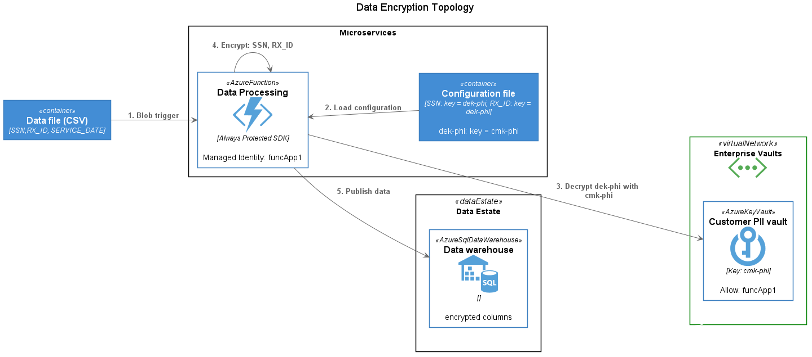

# Introduction

The project describes an Azure-native topology for applying column-level encryption for a variety of scenarios across an organization's data estate. It includes sample code and documentation for evaluation purposes.

The basis of this project is the newly published [Microsoft Data Encryption SDK](https://github.com/Azure/microsoft-data-encryption-sdk) (MDE), which provides consistent and portable tools for applying cryptography to meet data protection needs. These tools are full compatible with the existing implementation of [Always Encrypted](https://docs.microsoft.com/en-us/sql/relational-databases/security/encryption/always-encrypted-database-engine?view=azuresqldb-current), which is part of SQL Server.

Because these libraries are portable, a standardized and compatible approach to encryption can extend beyond just supported data engines such as Azure SQL Database. For example, records with sensitive columns encrypted via SQL Always Encrypted can be streamed as events as part of a change data capture (CDC) feed and subsequently decrypted and procecessed elsewhere by an authorized microservice.

## Encryption Scenarios

The model can be used to support three principal scenarios: (1) migration from on-premises systems to a data lake, (2) data preparation and analytics via a distributed processing system, and (3) event driven architectures. The following diagram highlights (in yellow) where the aforementioned code libraries would be incorporated as part of an implementation in Azure as well as the services that support encryption configuration and key management.



## Components

### Microsoft Data Encryption (MDE) SDK

The [MDE SDK]((https://github.com/Azure/microsoft-data-encryption-sdk)) is in preview and currently supports .NET 5. It provides the foundation for most of the samples in this repositry.

### Encryption Metadata

The configuration of encryption for sensitive columns is specified in a configuration file (or API), which may be stored in a highly-available location. This file represents the master record of encryption keys and algorithms used across all workloads. This file would likely be maintained by a compliance team and its configuration data, when updated, is applied (via automation) to supported data engines such as Azure SQL Database with Always Encrypted. Applications based on the aforementioned Encryption SDK would load updated settings using a modular settings provider.

The following is a sample configuraiton file where two columns are classified as sensitive are to be encrypted with the same encryption key (CEK) and algorithm. There is a one-to-many relationship between a given CEK and columns.

```yaml
ColumnEncryptionInfo:
- ColumnName: SSN
  ColumnKeyName: CEKConfidential
  EncryptionType: Deterministic
  Algorithm: AEAD_AES_256_CBC_HMAC_SHA256
- ColumnName: Email
  ColumnKeyName: CEKConfidential
  EncryptionType: Deterministic
  Algorithm: AEAD_AES_256_CBC_HMAC_SHA256
ColumnKeyInfo:
- Name: CEKConfidential
  EncryptedColumnKey: 0x01b40000016800740074007
  Algorithm: RSA_OAEP
  ColumnMasterKeyName: CMKConfidential
ColumnMasterKeyInfo:
- Name: CMKConfidential
  KeyProvider: AZURE_KEY_VAULT
  KeyPath: https://akvdemo.vault.azure.net/keys/democmk/abc123456
```

If the CEK is not present in the file, the prototype SDK will generate one and encrypt it using the Column Master Key (CMK) referenced in the `ColumnMasterKeyInfo` section. CEKs may be pre-provisined in the file if they had already been generated elsewhere.

> **NOTE:** Column Encryption Keys are always encrypted (wrapped) by a Column Master Key (CMK) hosted in Azure Key Vault. They are never exposed as plaintext. Access to decrypt CEKs is managed audited through Azure Key Vault access policies.

### Supported Data Engines

As previously mentioned, the use of the MDE SDK is fully compatible with native encryption support already available in Azure SQL Database. This provides seamless support for data processing is it flows in and out from various systems. [Sample Azure Functions](src/ColumnEncryptionFunctions/README.md) are provided in this repository that illustrate this capability. It should be noted that updates to the encryption metadata must be pushed to these systems as well via DevOps automation.

### Automation (DevOps)

Successful management of a distributed encryption infrastructure such as this relies on the use of modern automation practices based on tools such as Azure DevOps and/or GitHib Enterprise. A proposed management topology and workflow is discussed in more detail in the [Encryption Configuration Management](docs/management-and-ops.md) document.

## Next Steps: Deployment and Operations

Use following documentation for details on deployment and operations:

* [Encryption Configuration Management](docs/management-and-ops.md)
* [Configuration: Azure Environment](docs/configure-azure.md) (pre-requisites)
* [Configuration: Sample Console Application](src/ColumnEncryptionApp/README.md)
* [Configuration: Sample Azure Functions](src/ColumnEncryptionFunctions/README.md)
