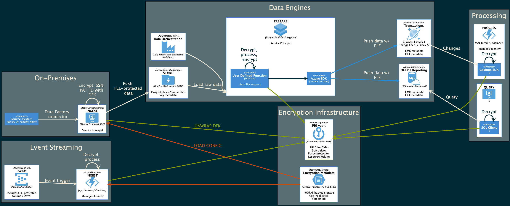

# Introduction

The project describes an Azure-native topology for applying column-level encryption for a variety of scenarios across an organization's data estate. It includes sample code and documentation for evaluation purposes.

The basis of this project is the newly published [Microsoft Data Encryption SDK](https://github.com/Azure/microsoft-data-encryption-sdk) (MDE), which provides the library behind [SQL Always Encrypted](https://docs.microsoft.com/en-us/sql/relational-databases/security/encryption/always-encrypted-database-engine?view=azuresqldb-current) as a .NET 5 class library avaialbe via NuGet packages.

Because these libraries are portable, a standardized and compatible approach to encryption can extend beyond just supported data engines such as Azure SQL Database. For example, records with sensitive columns encrypted via SQL Always Encrypted can be streamed as events in Avro format as part of a change data capture (CDC) feed. Individually encrypted fields can be subsequently decrypted and procecessed elsewhere by an authorized microservice using the MDE SDK.

## Encryption Scenarios

The model can be used to support three principal scenarios: (1) migration from on-premises systems to a data lake, (2) data preparation and analytics via a distributed processing engine, and (3) event driven architectures. The following diagram highlights (in yellow) where the aforementioned code libraries would be incorporated as part of an implementation in Azure as well as the services that support encryption configuration and key management.



## Components

### Microsoft Data Encryption (MDE) SDK

The [MDE SDK]((https://github.com/Azure/microsoft-data-encryption-sdk)) is in preview and currently supports .NET 5. It provides the foundation for most of the samples in this repositry. Out of the box, MDE support encrypting and decrypting Parquet files. The source code in this repository shows how MDE can be extended to add support for two additional formats: CSV and Avro.

### Encryption Metadata

The configuration of encryption for sensitive columns requires documenting the encryption type (ramdomized or deterministic), the identifier of the column encryption key (CEK) to be used, and the encryption algorithm. This information is stored witin a supported data engine (Azure SQL DB or Cosmos DB), embedded within files (Parquet or Avro), or externalized as a separate configuration file or API endpoint. For enterprise scenarions, this inforamtion must be hosted and maintained in a way that can serve as a master record of encryption encrypted column configuration across all workloads. This data would likely be maintained by a compliance team and any changes to it must be applied (via automation) to supported data engines such as Azure SQL Database with Always Encrypted. Applications based on the aforementioned MDE SDK would likewise need to refresh their configuration settings using a modular settings provider.

The following is a sample configuraiton schema where two columns are classified as sensitive are to be encrypted with the same encryption key (CEK) and algorithm. There is a one-to-many relationship between a given CEK and columns.

```yaml
ColumnEncryptionInfo:
- ColumnName: SSN
  ColumnKeyName: CEKConfidential
  EncryptionType: Deterministic
  Algorithm: AEAD_AES_256_CBC_HMAC_SHA256
- ColumnName: Email
  ColumnKeyName: CEKConfidential
  EncryptionType: Deterministic
  Algorithm: AEAD_AES_256_CBC_HMAC_SHA256
ColumnKeyInfo:
- Name: CEKConfidential
  EncryptedColumnKey: 0x01b40000016800740074007
  Algorithm: RSA_OAEP
  ColumnMasterKeyName: CMKConfidential
ColumnMasterKeyInfo:
- Name: CMKConfidential
  KeyProvider: AZURE_KEY_VAULT
  KeyPath: https://akvdemo.vault.azure.net/keys/democmk/abc123456
```

If the CEK is not present in the file, the prototype SDK will generate one and encrypt it using the Column Master Key (CMK) referenced in the `ColumnMasterKeyInfo` section. CEKs may be pre-provisined in the file if they had already been generated elsewhere.

> **NOTE:** Column Encryption Keys are always encrypted (wrapped) by a Column Master Key (CMK) hosted in Azure Key Vault. They are never exposed as plaintext. Access to decrypt CEKs is controlled through Azure Key Vault access policies. Detailed information for all Key Vault control and data-plane operations can be fully auditied.

### Supported Data Engines

As previously mentioned, the use of the MDE SDK is fully compatible with native encryption support already available in Azure SQL Database. This provides seamless support for data processing is it flows in and out from various systems. [Sample Azure Functions](src/ColumnEncryptionFunctions/README.md) are provided in this repository that illustrate this capability. It should be noted that updates to the encryption metadata must be pushed to these systems as well via DevOps automation.

### Supported File Formats

Formats such as Avro and Parquet allow for storing custom metadata as part of the file. This approach is used by the MDE SDK for Parquet and the Avro extension included in this repo does the same.

### Automation (DevOps)

Successful management of a distributed encryption infrastructure such as this relies on the use of modern automation practices based on tools such as Azure DevOps and/or GitHib Enterprise. A proposed management topology and workflow is discussed in more detail in the [Encryption Configuration Management](docs/management-and-ops.md) document.

## Next Steps: Deployment and Operations

Use following documentation for details on deployment and operations:

* [Configuration: Azure Environment](docs/configure-azure.md) (pre-requisites)
* [Configuration: Sample Console Application](src/ColumnEncryptApp/README.md)
* [Configuration: Sample Azure Functions](src/ColumnEncryptFunctions/README.md)
* [Operations: Encryption Configuration Management](docs/management-and-ops.md)
