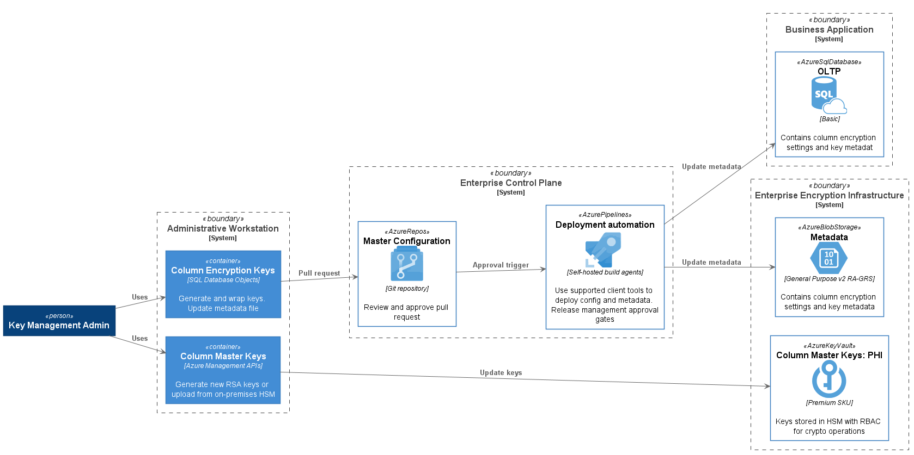

# Key Management

The encryption infrastucture involes two types of keys:

**Column Encryption Keys (CEKs)** - These are symetric (AES256) keys that are used to encrypt sensitive columns (fields). For performance and usability reasons, CEKs are typically embedded as metadata within a file or document or included as part of a database configuration. A CEK is always stored in an encrypted format so the metadata must always include a reference to a Column Master Key.

**Column Master Keys (CMKs)** - Used to encrypt (wrap) and decrypt (unwrap) Column Encryption Keys. They are typically RSA key pairs that are stored in a hardware security module (HSM) such as Azure Key Vault.
 
Managing these keys involves tools and processes to ensure keys are properly created, secured, distributed, rotated, and made highly available. The following sections of this document describes tools and processes for achieving this.

> Further information about key management can be reviewed in the Azure SQL Database document: [Overview of key management for Always Encrypted](https://docs.microsoft.com/en-us/sql/relational-databases/security/encryption/overview-of-key-management-for-always-encrypted?view=azuresqldb-current). The tools and concepts discussed in this repo are designed to be consistent and compatible with Always Encrypted, which is a fully supported, Generally Available feature. 

## Creation and Distribution

All key generation activites are accomplished using existing, generally available tools which are deployed to a secure workstation. Distribution and updates to the business applications and core encryption services is achieved though a managed Continuous Deployment pipeline that includes release gates for coordination across systems. The following diagram illustrates the workflow:

### Column Master Keys

CMKs can be generated in a variety of ways, [including from within a compatible on-premises HSM infrastructure](https://docs.microsoft.com/en-us/azure/key-vault/key-vault-hsm-protected-keys). Once a CMK is uploaded to an HSM, it cannot be exported or exfiltrated and instead can only be used for authorized cryptographic operations. The [az keyvault key create](https://docs.microsoft.com/en-us/cli/azure/keyvault/key?view=azure-cli-latest#az-keyvault-key-create) command is an example of a way by which a CMK can be created.

### Column Encryption Keys and Metadata

The [SqlServer PowerShell module](https://docs.microsoft.com/en-us/sql/relational-databases/security/encryption/configure-column-encryption-using-powershell?view=azuresqldb-current) allows for generating and encrypting (wrapping) CEK's via easy-to-use commands that can be deployed for use on secure workstations. This repository includes a sample script that implements these commands. See: [cek-create.ps1](../scripts/cek-create.ps1)

Once CEKs are generated, Key Management admins must then update the metadata configuration (YAML) file and issue a Pull Request to the Git repository for approval and deployment to Azure infrastructure.

## Key Rotation

## Access Control

### Administrative Access

### Data Access

Column Encryption Keys (CEKs) do not have explicit access control. Instead, access is *implicitly* granted by assigning users and processes access to decrypt them via the CEK's assigned Column Master Key (CMK). Azure Key Vault (AKV) provides the facility to do this via [Access Policies](https://docs.microsoft.com/en-us/azure/key-vault/key-vault-secure-your-key-vault).

## Availability and Recovery

The loss of any key used for encryption purposes means the loss of the data. Therefore, safeguards must be put into place to ensure both CEKs and CMKs are available and cannot be accidentally or intentionally deleted.
