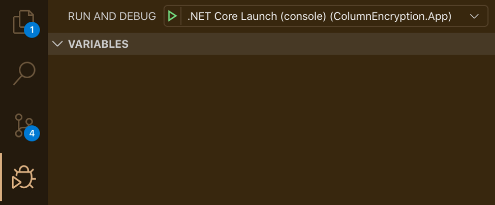
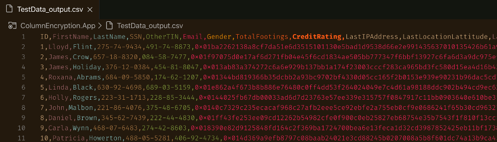

# Column Encryption Sample Application

This is a sample console application written in .NET 5.0 that uses Microsoft Data Encryption packages to encrypt and decrypt columns within data files.

## Prerequisites

Be sure your environment meets the following conditions:

1. You have completed the [deployment and configuration steps](../../docs/configure-azure.md) for Azure Key Vault and a Service Principal within your Azure Environment
2. [.NET 5.0 SDK](https://dotnet.microsoft.com/download/dotnet/5.0) installed
3. Visual Studio Code with the [Azure Functions extension](https://marketplace.visualstudio.com/items?itemName=ms-azuretools.vscode-azurefunctions) configured

## Setup (local development)

### Service Principal Authentication

For additional security when running in Azure, the code for this sample application is designed to run under the context of a [system-assigned Managed Identity](https://docs.microsoft.com/en-us/azure/active-directory/managed-identities-azure-resources/overview). To replicate the use of a Managed Identity for local development and debugging, an environment variable must be set using the applicaitonId and secret of a regular service principal. In Windows 10, this is done via the following command:

```cmd
set AzureServicesAuthConnectionString=RunAs=App;AppId={appId};TenantId={tenant};AppKey={password}
```

For MacOS users, update your `.zshrc` file as following:

```bash
export AzureServicesAuthConnectionString="RunAs=App;AppId={appId};TenantId={tenant};AppKey={password}"
```

In either case, replace the value of `{appId}`, `{tenant}`, and `{password}` with the output from the Service Principal creation steps documented earlier.

### Add the metadata configuration file

Place a copy of the YAML configuraiton file you defined previously in the project root directory and ensure it is named `TestConfig.yaml`. This will ensure the configuration is included as part of the applicaiton build output.

## Run the demo

Use the Visual Studio debugger to as shown here to build and launch the sample application:



By default, you will see the output file named `TestData_output.csv` placed at the project root directory. Open the file and you should see encrypted values for the columns you configured.


