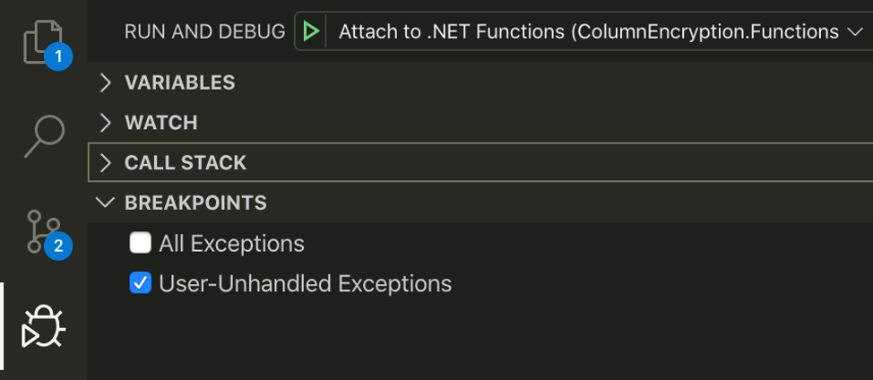
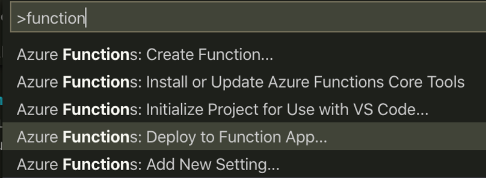

# Column Encryption Azure Functions

This is a set of Azure Functions that utilize the SQL Always Encrypted libraries to encrypt and decrypt column (field-level) data for the following:

* `ProtectCsv`: Blob trigger function that takes a CSV file as input, performs encryption based on an input YAML config file, and writes an output file in a separate blob container.
* `CopyToSql`: Blob trigger function that takes in a CSV file that contains encrypted columns and inserts records into an Azure SQL Database without first decrypting the data. This showcases movement of encrypted data across platforms that may not natively support Always Encrypted.

## Prerequisites

Be sure your environment meets the following conditions:

1. You have completed the Azure [deployment and configuration steps](../../docs/configure-azure.md) for the SQL database, Azure Key Vault, and a Service Principal
2. [.NET 5 SDK](https://dotnet.microsoft.com/download/dotnet/5.0) installed
3. Visual Studio Code with the [Azure Functions extension](https://marketplace.visualstudio.com/items?itemName=ms-azuretools.vscode-azurefunctions) configured

## Setup and Debug (local)

To run these functions locally, create a `local.settings.json` in the Functions project root directory with the following format:

```json
{
  "IsEncrypted": false,
  "Values": {
    "AzureWebJobsStorage": "",
    "FUNCTIONS_WORKER_RUNTIME": "dotnet-isolated",
    "FUNCTIONS_EXTENSION_VERSION": "~3",
    "SQL_CONNECTION": ""
  }
}
```

Populate the following values to match the following items you created during the Azure setup:

* **AzureWebJobsStorage**: Matches the value in the **Configuration** section of the Function App
* **SQL_CONNECTION**: Equals the connection string to the test database

> **NOTE:** Information contained within this file is sensitive and should be used only for development and testing purposes. Contents of this file should never be shared. By deafult, this file is exempted from Git in order to prevent it from being added to source code repositories.

Once this is completed, you should now be able start the Functions runtime by navigating to the Debug icon in VS Code and clicking the green Start button with "Attach to .Net Functions" selected.



Alternative, you can start the function app without debugging by entering `func init` into a terminal session from the ColumnEncryptionFunctions directory.

## Deploy to Azure

There are several options for deploying source code for Function Apps to Azure. One straighforward approach is to push the sourcecode via the Azure Functions extension for VS Code. This is done by [invoking the Command Palette](https://code.visualstudio.com/docs/getstarted/userinterface#_command-palette) and entering "Functions" in the cursor. The deployment option will be suggested as shown below.



After selecting your subscription and Function App, VS Code will handle the deployment.
